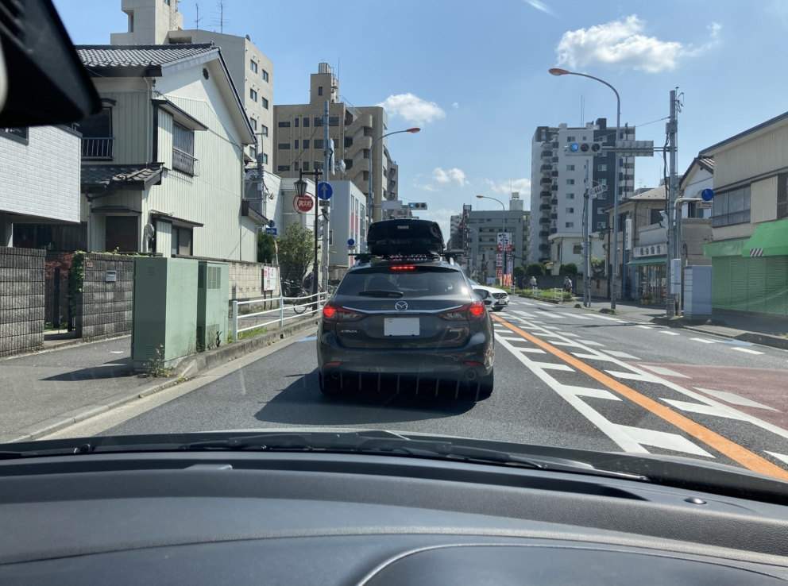
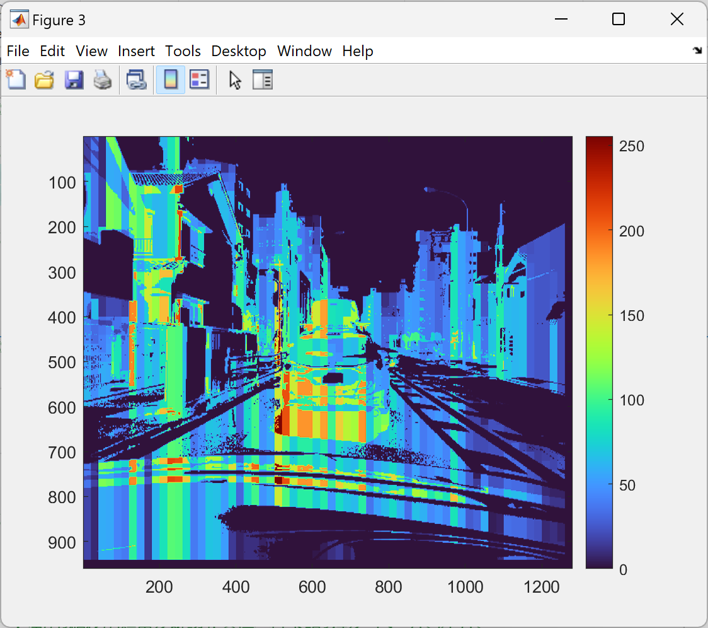

# depth_estimate_blur
## Defocusによる画像ボケを利用した深度推定  
TIER IV C1カメラのレビューをしていたところ，光学的に良好な特性を持つカメラであることがわかった．ここにテスト用コードとともに，良好な特性結果をここに簡易にまとめた．

組み込み向けCPUなど処理能力やメモリといったリソースが比較的少ないデバイスでのコンピュータビジョンにも利用できそうである．
(組み込み機器にGMSL2インターフェースがあるのかという議論はまた別であるし，USB変換も可能であるのでここでは取り上げない)

ここでは順に
- コードの動かし方
- 調整方法
- 使用機材
- C1カメラについて
- Defocus blurを利用した深度推定の技術的背景について
- 結論

を取り上げていく．

## コード
ここからはすべてTIER IV C1カメラで撮像した映像を前提とする．他の撮像デバイスから取得した映像は，ここにあげたコードでの動作は推奨されない．

なお，下記説明はオフラインのMATLABでの動作を前提としているが，[ブラウザからMATLAB Onlineでも動作確認ができる](https://matlab.mathworks.com/open/github/v1?repo=panda5mt/depth_estimate_blur&file=./main.m)
．アカウントを取得済みであれば，即導入できるので是非試していただきたい． (Thanks [@minoue-xx](https://github.com/minoue-xx))

https://matlab.mathworks.com/open/github/v1?repo=panda5mt/depth_estimate_blur&file=./main.m
1. 静止画での深度推定
    - 動作確認

        元の画像は以下のものを使用する．
    

        [main.m](./main.m)をMATLAB/MATLAB onlineで実行する．

        下記Figureが出現する．
    
        カラーマップは赤色になるほどカメラに近く，水色ほど遠ざかる．(物体は焦点面よりもレンズから遠ざかっているものとする) ナンバープレートは加筆で消したため，その部分の深度推定ができなくなっている模様である．ご了承いただきたい．
    - パラメータ調整

        [深度適用時のフィルタ長さNと物体の閾値thres](https://github.com/panda5mt/depth_estimate_blur/blob/main/main.m#L7-L11)を調整することができる． $N$ は解像度が高いときは大きめ，解像度低めの際は小さめにすると良好な特性が得られることが多い． ( $4\le N \le 25$ )．
    
        物体が存在していないはずのところを深度推定している場合は $thres$を0より大きくすると解決することがある．( $0\le thres \le N^2 \times \frac{1}{2}$)

2. 動画での深度推定
    
    準備中

## TIER IV C1カメラとは
- [自動運転&モビリティ向け車載HDRカメラ](https://www.paltek.co.jp/solution/tier4/index.html)だよすごいねぇぇぇぇぇぇ．
    TODO: 後で真面目に書く

## 映像を撮影，録画した環境について
- TIER IV C1カメラ(FoV:85deg)
- レッツノートQV1 (Win11)標準のカメラアプリ．[GMSL2-USB3変換](https://tier4.github.io/camera_docs/usb_convert_jp/)を経由している．
- SUZUKI Swift Sport ZC33S(屋根上15cm) / Swift RS ZC83S(車内フロントガラス貼り付け)

## アドバンテージ 
1. 高速化のための工夫    
詳細は後述するが，Defocus Blurによる深度推定は大まかに下記の手順を毎フレーム，画像ごとに処理を行う．
- sparse(疎)な深度推定
    - ガウスフィルタのたたみ込み
    - Cannyエッジによる輪郭抽出

- dense(密)な深度推定　
    - Superpixelによる画像の分割
    - 分割された画像に隣接するスパースな深度推定を利用しSuperpixel画像に意味づけを行い，深度情報となる値で塗りつぶす
         
    昨今の深層学習と比較すれば軽量ではあるものの，安価なローエンドFPGAやマイクロコンピュータには重労働となる．

2. 各ロジックの代替となる画像処理

    高速化やコード量の削減のため，工夫をしている．
- [長船blur](./f_blur.m) : ガウシアンフィルタの代替

    ガウスフィルタは通常，1枚の画像につき， $\sigma$を変化させつつ，2ないし4回たたみ込みを行う．

    対する長船blurはこれを[x軸方向，1次元でガウスフィルタ](./f_blur.m#L27)を適用，[y軸方向に1次元でメディアンフィルタを実行](./f_blur.m#L32)，続いて[差分を計算](./main.m#L39)することによりSparseな深度を計算するため，たたみ込み演算に比べて遙かに高速である．[長船によりFPGA向けに設計されたアルゴリズムであり](https://github.com/osafune/)，y軸方向はメディアンを採用したことにより，画像1枚分全部をRAMに保持する必要がなくなる(メディアン長さ分のみ保持すればよい)．組み込み向けデバイスのような省メモリデバイスでも動作し，高速に動作する．
- [LoGフィルタ](./main.m#L41-L42) : Cannyエッジ検出器の代替

    物体のエッジ情報をある程度均一化し，輪郭を取得するフィルタ．Cannyには劣るものの，カーネル1つで処理ができるため，より高速な処理が期待できる．長船blurと併用しスパースな深度推定をする．

    リソースが厳しい場合，LoGフィルタは省いてもよい．しかし，エッジが多い構造物がある場合，深度推定が難しくなる．エッジ情報から平均をとるなど別途手段が必要となる．

- [大津の二値化](./my_graythresh.m) : superpixelの代替

    C1カメラはHDRカメラであり，大津の二値化を行った際，大きく閾値が動くことはまれである．
    この性質を利用し，簡易なセグメンテーションを大津の二値化を利用して行った．superpixelの代替として最低限の性質を示しており，深度推定の障害とはなりにくいと思われる．
    
    また固定値でもそれなりに動作すると思われるので，画素の合計値や平均値などが著しく変化したときのみ，つまり環境光が大きく変化した時のみ大津の二値化を再計算するだけでもよいと思われる．

    今回は，大津の<ins>3値化</ins>を行い，簡易セグメンテーションを行っている．

## 深度推定基本
1. 深度推定において参考となる論文は下記2つである

    - [Defocus map estimation from a single image](https://www.sciencedirect.com/science/article/abs/pii/S003132031100094X) (Zhuoらによる)
    - [Fast Defocus Map Estimation](http://www.cs.nthu.edu.tw/~htchen/fdme/)(Chenらによる)
2. 概要
    - 対象物が焦点距離に近い場合，ピントが合っている状態となるが，遠ざかれば遠ざかるほど，ピントは合わなくなる．
    - 画像処理でピントが合っている画像を意図的にボケさせることができる．ガウシアンフィルタ．
    - 焦点が合っている部分ほど強くボケがかかり，すでにぼやけている部分にボケをかけてもそれほど差が生じない.
        
    - ボケの度合いを推定するには輪郭を抽出しどれほど減衰したかで知ることができる
    - 輪郭抽出にはCannyエッジフィルタが最適であることがわかった
    - この性質を利用すれば，1枚の画像から疎な深度情報を推定することができる
    - dense(密)な深度推定はsuperpixelによる画像分割から行う　
3. 数式での表現
- $c$をCoC(錯乱円:完全な焦点にならないことにより起こる光スポット)とする
- $f_0$を焦点距離，レンズ中心からの像の距離を $d$とし，焦点面 $d_f$よりもレンズから遠い前提とする．このとき $c$は以下の式を満たす．

    - $c=\frac{|d-d_f|}{d}\cdot\frac{f_0^2}{N(d_f-f_0)} ...(1)$
- ガウス関数のうち，正規分布表現は以下の式で表される
    - $g(x,\sigma) = \frac{1}{\sqrt{2\pi}\sigma}\cdot\exp \lbrace -\frac{(x-\mu)^2}{2\sigma^2} \rbrace...(2)$
        
        但し  $\sigma$ :標準偏差， $\sigma^2$:分散
- Thin lens modelの場合に限るが，焦点ずれにより生じるボケは鮮明な画像とガウス関数とのたたみ込みでモデル化できる．また偏差 $\sigma$は $c$に比例するため， $\sigma = kc$と表現できる．元画像のエッジを $f(x)$ とすると，ボケのエッジ $i(x)$は下記のように表せる．
    - $i(x) = f(x) \otimes g(x,\sigma)...(3) $

- 焦点からのずれによるボケの推定

    画像中のぼやけたエッジにさらにガウス関数をたたみ込むことを考える． $\Rightarrow$ さらにエッジがぼやけることが想定されるが，鮮明なエッジにたたみ込むときほどの減衰は見られない．
    
    式 $(3)$より，ぼけたエッジを $i(x)$にさらにガウス関数をたたみ込む場合
    - $i_1(x) = i(x) \otimes g(x,\sigma_0) $ 

         = $(Au(x)+B)\otimes g(x,\sigma)\otimes g(x,\sigma_0)...(4) $
    
    となる．エッジを計算する際，強度勾配を求めるので
    
    - $\nabla(i_1(x)) = \nabla(i(x) \otimes g(x,\sigma_0))$

         $=\nabla \lbrace (Au(x)+B)\otimes g(x,\sigma)\otimes g(x,\sigma_0) \rbrace...(5)$
    
    正規分布関数の定義により，

    - $\nabla(i_1(x)) = \frac{A}{\sqrt{2\pi(\sigma^2+\sigma_0^2)}}\cdot\exp\lbrace -\frac{x^2}{2(\sigma^2+\sigma_0^2)}\rbrace...(6)$

         $\sigma_0$ : re-blurガウスカーネルの標準偏差．re-blur scaleとも．
    
    - 元のボケエッジとre-blurエッジとの強度勾配の比を求める．
        
         $\frac{|\nabla i(x)|}{|\nabla i_1(x)|}=\sqrt{\frac{\sigma^2+\sigma_0^2}{\sigma^2}}\cdot\exp \lbrace -(\frac{x^2}{2\sigma^2}-\frac{x^2}{2(\sigma^2+\sigma_0^2)})\rbrace...(7)$

         この比が最大になるのは $x=0$の時であるのは明らかなので

         $\frac{|\nabla i(0)|}{|\nabla i_1(0)|}=\sqrt{\frac{\sigma^2+\sigma_0^2}{\sigma^2}}\equiv R...(8)$

    - 式 $(6)$， $(8)$からわかるようにエッジ上での強度勾配は振幅 $A,\sigma,\sigma_0$ のみに依存する．従って未知のボケ量 $\sigma$は式 $(8)$から

         $\sigma=\frac{1}{\sqrt{R^2-1}}\sigma_0$

         で求められる．

## 結論 
チューニングされたThin lens modelに従う複合レンズと，HDRイメージセンサを搭載したC1カメラを簡易評価した．優れた光学的特性，そしてイメージセンサのダイナミックレンジにより，単純なロジックでも深度推定が可能であることを示した．

ADASも含め，ロボティクス方面でカメラを利用したり，工場内移動ロボット(群ロボ)などコンピュータリソースが潤沢にない環境で画像処理をする分野で威力を発揮するものと思われる．
